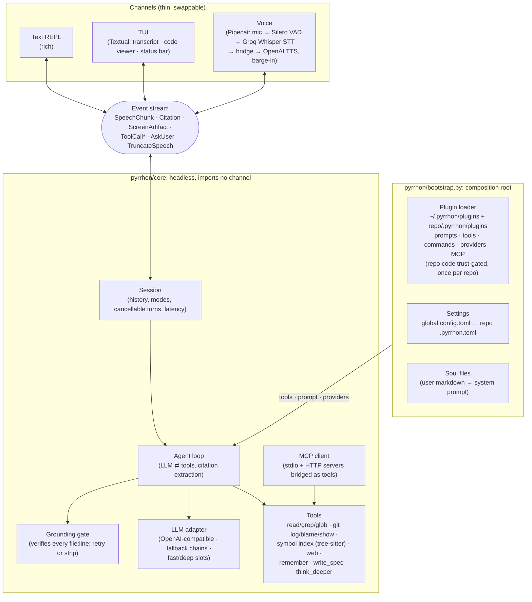

# Pyrrhon

A voice-first engineering agent that runs in your terminal. You talk to it, it
talks back, and every claim it makes about your code cites a real `file:line`.
You can interrupt it mid-sentence.

Pyrrhon does two things.

**Understand a codebase you didn't write.** Point it at a repo and ask how a
feature works, where to add something, or what changed last week. Every answer
cites a real location or says it doesn't know. It will not invent a path to
sound complete, and the terminal shows the code being discussed while you talk.

**Design a system you're about to build.** Pyrrhon interrogates the idea the way
a senior architect would ("your data looks relational, so what do you expect
Mongo to buy you over Postgres?"), then writes the spec once the reasoning holds
up: `PRD.md`, `HLD.md`, `LLD.md`, `api.md`, `database.md`, `risks.md`.

## Install

Requires Python 3.12 or 3.13. Not 3.14 yet: `pyaudio`, which the voice stack
pulls in, ships no wheel for it, and a version cap turns that into one clear
sentence instead of a compiler error.

```bash
uv tool install pyrrhon      # recommended: an isolated install with `pyrrhon` on PATH
pipx install pyrrhon         # same idea without uv
pip install pyrrhon          # into the current environment
```

To work on Pyrrhon itself:

```bash
git clone https://github.com/prabhjot0109/Pyrrhon && cd Pyrrhon
uv sync                  # text, TUI, and voice
```

One command installs everything, every speech provider included. Nothing in the
provider menu needs a second install step. The cost is a larger environment —
about 1.2 GB, because on-device turn detection and the local speech engines
bring their own model runtimes. Text and TUI still never import the audio stack
at runtime, and `--voice` degrades to text mode with a readable reason if it
cannot start.

## Usage

```bash
uv run pyrrhon --setup               # pick providers, paste keys
uv run pyrrhon /path/to/some/repo    # Textual TUI (default)
uv run pyrrhon --text .              # plain-text REPL
uv run pyrrhon --voice .             # TUI with the voice pipeline on
```

Sessions are saved, so a week-long walkthrough does not restart every morning:

```bash
uv run pyrrhon --continue .          # pick up this repo's most recent session
uv run pyrrhon --resume 20260901 .   # a specific one; a leading prefix is enough
uv run pyrrhon --no-save .           # keep nothing
```

Only the questions and the answers are saved — never tool output, and never a
line number. A resumed session therefore has to reopen a file before it can
cite one, which is the grounding rule enforced by the shape of the data rather
than by asking the model nicely.

And one question, non-interactively, for scripts and CI:

```bash
uv run pyrrhon --print "how does the retry path work?" .
echo "where is the cache invalidated?" | uv run pyrrhon -p --json .
```

The answer goes to stdout and nothing else does; progress goes to stderr, and
`--json` adds the citations and the turn's trace as data.

Text and TUI need one LLM key. Groq is the default:

```bash
export GROQ_API_KEY=gsk_...          # PowerShell: $env:GROQ_API_KEY = "gsk_..."
```

A first launch with no configuration offers the setup wizard. Wizard keys are
stored owner-only in `~/.pyrrhon/credentials.toml`, never in project config, and
environment variables always win. `/settings` shows what is configured and where
each key came from.

Voice additionally needs `OPENAI_API_KEY` for TTS; STT runs on the same Groq
key. Inside the TUI, `/voice on|off` toggles the pipeline. Start talking
whenever and interrupt whenever: barge-in rewrites history to exactly what you
heard.

Commands worth knowing: `/help`, `/mode design`, `/model fast
groq/llama-3.3-70b-versatile`, `/mcp`, `/plugins`, `/code` (opens the last
citation in your editor), `/debug-history`, `/quit`.

For the session itself: `/covered` (what you have established so far), `/clear`
(a fresh thread, same window), `/compact` (summarize now, and say by how much),
`/cost` (tokens and requests this session), `/export` (the walkthrough as
markdown, with its citations), `/sessions` (what `--resume` can pick up).

## Configuration

Settings merge from `~/.pyrrhon/config.toml`, then `<repo>/.pyrrhon.toml`, where
the repo wins. All of it is optional.

```toml
fast = { provider = "groq", model = "llama-3.3-70b-versatile" }  # every turn
deep = { provider = "openai", model = "o4-mini" }                # think_deeper escalation

[fallbacks]
fast = ["cerebras", "openrouter/meta-llama/llama-3.3-70b-instruct"]

[context]
budget_tokens = 32000       # estimated tokens before old turns are summarized
keep_last_messages = 8      # recent messages always kept verbatim

[providers.myllm]                       # any OpenAI-compatible endpoint
base_url = "http://localhost:8000/v1"
api_key_env = "MYLLM_KEY"

[mcp_servers.docs]                      # MCP tools join the agent's toolset
command = "docs-mcp"                    # stdio, or: url = "http://..." for HTTP
```

Built-in providers are `groq`, `openai`, `gemini`, `deepseek`, `cerebras`,
`openrouter`, and `huggingface`, each needing only its `*_API_KEY` environment
variable. Hugging Face uses `HF_TOKEN` against the Inference Providers router.
Two keyless local providers ship as well: `ollama` (`http://localhost:11434/v1`)
and `lmstudio` (`http://localhost:1234/v1`).

Drop markdown "soul files" into `~/.pyrrhon/` or `<repo>/.pyrrhon/` to give
Pyrrhon standing context about you or the repo. `/init` scaffolds one.

### Voice providers

```toml
[voice]
stt_provider = "groq"          # see the table below
tts_provider = "cartesia"      # openai is the default
tts_voice = "<voice-id>"       # OpenAI/Groq voice name, Gemini voice (Kore/Puck/...), Cartesia/ElevenLabs id, or Deepgram Aura voice
tts_model = "sonic-2"          # optional provider-specific model (for huggingface TTS, the HF model id)
turn_detection = "smart"       # semantic end-of-turn; "vad" is the fixed-silence fallback
idle_timeout_sec = 0           # seconds of your silence before it re-engages; 0 is off
# tts_url = "http://localhost:5000"   # piper HTTP-server mode only (default is in-process)
```

| Task | Cloud (API key)                                                                                        | Local (keyless)                                                          |
| ---- | ------------------------------------------------------------------------------------------------------ | ------------------------------------------------------------------------ |
| LLM  | Groq, OpenAI, Anthropic, Gemini, DeepSeek, Cerebras, OpenRouter, Hugging Face                          | Ollama, LM Studio                                                        |
| STT  | Groq Whisper, OpenAI, Deepgram, Cartesia, AssemblyAI, Gladia, Gemini, Hugging Face                     | whisper-local (faster-whisper: tiny through large-v3, distil, any HF id), Moonshine |
| TTS  | OpenAI, Groq, Cartesia, ElevenLabs, Deepgram Aura, Rime, Inworld, Gemini, Hugging Face                 | Piper (in-process, downloads voices on demand), Kokoro                   |

OpenAI TTS is the zero-setup default. For real-time conversation, Cartesia and
ElevenLabs are noticeably snappier, roughly 100 to 300ms to first audio against
400ms and up. A fully local, keyless stack also works: `whisper-local` for STT,
`piper` for TTS, and Ollama or LM Studio for the LLM.

**Pyrrhon will offer you a provider it cannot currently run. It will never
imply that it can.** `/settings stt|tts` and the setup wizard label every row
with what it would actually take:

```
/settings tts
  piper          [ready]  free, on-device, no key and no server
  groq           [ready]  hosted TTS on your Groq key; needs an explicit voice id
  openai         [ready, unverified]  no extra key if you already use OpenAI
  cartesia       [needs CARTESIA_API_KEY]  lowest latency; needs a voice id from your account
  kokoro         [install: uv add "pipecat-ai[kokoro]"]  free, on-device, ONNX
```

`ready, unverified` is the honest one: the provider is installed and keyed, but
nobody has run a real utterance through it. Pyrrhon curates more providers than
any one person holds keys for, so a row earns plain `ready` only after
`pytest tests/test_voice_live.py -m live` has actually made it speak or
transcribe. Honest beats broad.

Gemini Live speech-to-speech is deliberately absent. It generates speech
directly from audio, which skips the agent loop and the grounding gate that
checks every `file:line` before it is spoken. Gemini participates as LLM, STT,
and TTS instead, each behind the gate.

## Security model

Pyrrhon is designed so that a voice agent cannot damage your repo even when the
model is wrong.

- Read-only by construction. The only write tool is `write_spec`, which accepts
  exactly six filenames (`PRD.md`, `HLD.md`, `LLD.md`, `api.md`, `database.md`,
  `risks.md`) and writes only under `docs/design/`.
- No shell. Git access is three read-only subcommands (`log`, `blame`, `show`)
  run as argv lists, so there is no command string to inject into. Paths are
  resolved and rejected if they escape the repo.
- Grounded speech. Every `file:line` claim is checked against the real repo
  before it is spoken. Unverifiable claims are stripped on voice or corrected
  once on screen, and Pyrrhon says "I'm not certain" rather than guessing.
- Keys out of the repo. They live in `~/.pyrrhon/credentials.toml` with
  owner-only permissions, and environment variables take precedence.

`tests/test_safety.py` and `tests/test_repo_trust_boundary.py` pin these.

### What a cloned repo may and may not do

A repo you have never read is untrusted input. Its `.pyrrhon.toml` and
`.pyrrhon/` directory are that stranger's suggestions rather than your
configuration, so keys are split by what each one can actually do.

| Repo supplies                                                               | Effect                                                                                                            |
| --------------------------------------------------------------------------- | ----------------------------------------------------------------------------------------------------------------- |
| `[voice]` (except `tts_url`), `[model]`, `[context]`                        | Applied. Cosmetic knobs.                                                                                          |
| `[fast]`, `[deep]`, `[fallbacks]` naming a builtin or _your_ provider       | Applied. A repo may suggest `groq/llama-3.3`.                                                                     |
| `[mcp_servers.*]`                                                           | Needs consent. It launches a program.                                                                             |
| `[providers.*]`                                                             | Needs consent. It decides where your prompts and API key go.                                                      |
| `voice.tts_url`                                                             | Needs consent. Piper HTTP mode POSTs everything Pyrrhon says to that URL.                                         |
| `[fast]`/`[deep]`/`[fallbacks]` naming a provider _the repo itself defined_ | Needs consent. Same key redirection, one level of indirection away.                                               |
| `.pyrrhon/*.md` (soul files)                                                | Needs consent. They are appended to the system prompt, so an ungated one can tell Pyrrhon to stop citing sources. |
| `.pyrrhon/plugins/*` with tools or commands                                 | Needs consent. It is Python that Pyrrhon would import and run.                                                    |

Everything needing consent is collected into one startup prompt listing each
item and what approving it allows. Declining is not fatal: the session opens
with whatever permissions it already has.

Consent is recorded in `<repo>/.pyrrhon/trusted` and bound to the value's
content rather than its name. Approving `mcp_servers.indexer = "node ./build.js"`
approves that command, and if the repo later changes it you are asked again.
Editing an approved soul file re-prompts for the same reason. Your own
`~/.pyrrhon/config.toml` is never gated, and files Pyrrhon writes itself
(`/init`'s `soul.md`, the `remember` tool's `memory.md`) self-grant.

For automation, `pyrrhon --trust-repo` grants everything without prompting. It
runs programs the repo chose, so use it only where you already trust the repo. A
run with no interactive terminal (piped stdin, CI) refuses silently rather than
hanging on a prompt or auto-approving.

## Architecture

Headless core, thin channels. The core never imports a channel. Channels
subscribe to a typed event stream and render it however they like.



Three invariants hold across the codebase.

Grounding is mandatory. The gate checks every cited `file:line` against the repo
before it is spoken. An unverifiable citation triggers one self-correction round
trip on text channels, or is stripped immediately on voice, where a retry would
blow the latency budget.

Real-time discipline holds everywhere in `core/`. No synchronous filesystem or
CPU work runs inline in an `async def`; anything blocking goes through
`asyncio.to_thread`, so audio never glitches while a tool reads disk.

There is one composition point. `pyrrhon/bootstrap.py` assembles the LLM, tools,
prompt, MCP servers, and plugins. Nothing else constructs an `Agent`.

## Plugins

A plugin is a folder with a `plugin.toml`, dropped into `~/.pyrrhon/plugins/`
for global scope or `<repo>/.pyrrhon/plugins/` for one repo.

```toml
name = "hello-reviewer"
version = "0.1.0"

[contributes]
prompts = ["prompts/*.md"]      # appended to the system prompt
tools = "tools.py:get_tools"    # Python entry point returning list[Tool]
```

Plugins contribute prompts, tools, slash commands, LLM providers, and MCP
servers. All of it is additive, so a plugin never overrides your config or the
built-ins. Prompts and config load from anywhere, but repo-level plugin code
runs only after a one-time consent prompt recorded in `<repo>/.pyrrhon/trusted`.
A broken plugin is skipped with one warning instead of crashing the session, and
`/plugins` shows what loaded. See the worked example in
[`tests/fixtures/plugins/hello-reviewer/`](tests/fixtures/plugins/hello-reviewer/).

## Development

```bash
uv run pytest                    # full suite, no API keys needed
uv run pytest path/to/test.py::test_name
uv run ruff check . && uv run mypy pyrrhon/core
uv run python -m pyrrhon.evals.grounding evals/grounding.yaml  # real-LLM eval
```

| Path                                                | What lives there                                         |
| --------------------------------------------------- | -------------------------------------------------------- |
| `pyrrhon/core/`                                     | The headless agent. Imports nothing from outer layers.   |
| `pyrrhon/bootstrap.py`                              | Composition root: builds the Agent, runs the trust gate. |
| `pyrrhon/channels.py`                               | The event-to-renderer dispatch table shared by channels. |
| `pyrrhon/repl.py`, `pyrrhon/tui/`, `pyrrhon/voice/` | The three channels.                                      |
| `pyrrhon/commands/`                                 | Slash commands, registered by decorator.                 |
| `pyrrhon/config/`, `pyrrhon/plugins/`               | Settings, credentials, trust, plugin loader.             |

[CLAUDE.md](CLAUDE.md) documents the layering rule and how to add a tool, event,
command, or provider.

## License

MIT. See [LICENSE](LICENSE).
