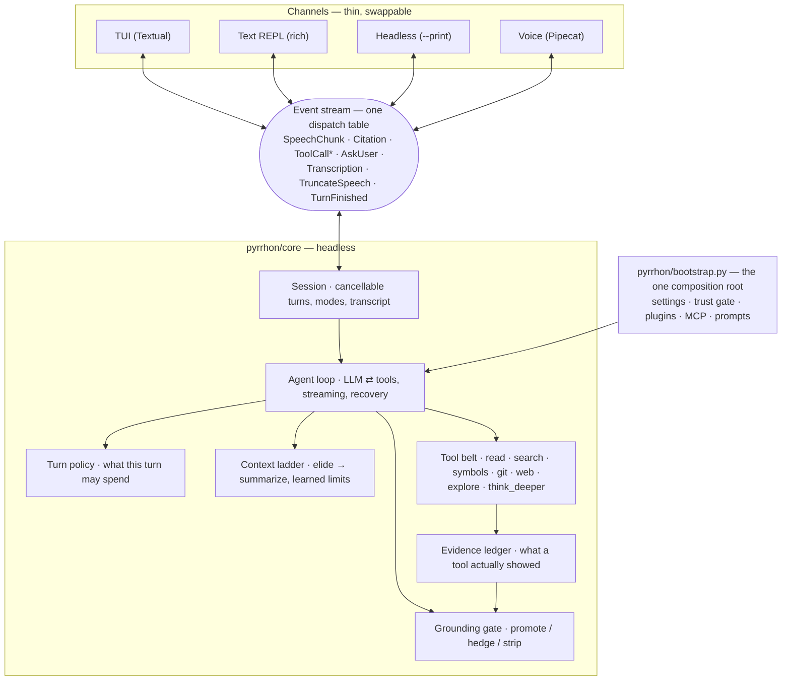

# Pyrrhon

**A voice-first engineering agent for your terminal.** You talk to it, it talks
back, and every claim it makes about your code cites a real `file:line` — or it
says it does not know. You can interrupt it mid-sentence.

[](https://github.com/prabhjot0109/Pyrrhon/actions/workflows/ci.yml)
[](https://www.python.org/)
[](LICENSE)

Named for Pyrrho the skeptic: suspend judgment, question assumptions, never
bluff. Pyrrhon does two things.

**Understand a codebase you didn't write.** Ask how a feature works, where to
add something, or what changed last week. Every answer cites a real location or
admits ignorance — it will not invent a path to sound complete — and the
terminal shows the code while you talk.

**Design a system you're about to build.** It interrogates the idea the way a
senior architect would ("your data looks relational, so what do you expect
Mongo to buy you over Postgres?"), then writes the spec once the reasoning holds
up: `PRD.md`, `HLD.md`, `LLD.md`, `api.md`, `database.md`, `risks.md`.

---

## Status

Pre-1.0, and honest about which parts are which.

| | |
|---|---|
| **Built and tested** | The agent harness, the grounding gate, both channels, the voice pipeline, session persistence, plugins, MCP. ~1260 tests, no API key required. |
| **Measured** | Latency (M10), the tool policy (a fifth of tool rounds removed), context handling under a real 8k-token ceiling. |
| **Not yet measured** | Answer quality on a repo neither author wrote. Two stranger repos are frozen with 34 hand-derived cases in [`evals/strangers/`](evals/strangers/), waiting on a funded provider key. |
| **Deliberately absent** | Any tool that writes outside `.pyrrhon/`. Speech-to-speech (it would bypass the grounding gate). |

Pyrrhon is a *teaching* agent, not an editing one. It reads your repo and
explains it. It does not change your code, and there is no plan for it to.

## Install

Python 3.12 or 3.13. Not 3.14 yet — `pyaudio`, which the voice stack pulls in,
ships no wheel for it, and a version cap turns that into one clear sentence
instead of a compiler error.

```bash
uv tool install pyrrhon      # recommended: isolated, with `pyrrhon` on PATH
pipx install pyrrhon         # same idea without uv
pip install pyrrhon          # into the current environment
```

One command installs everything, every speech provider included. Nothing in the
provider menu needs a second install step. The cost is a ~1.2 GB environment,
because on-device turn detection and the local speech engines bring their own
model runtimes. Text and TUI never import the audio stack at runtime, and
`--voice` degrades to text with a readable reason if it cannot start.

To work on Pyrrhon itself:

```bash
git clone https://github.com/prabhjot0109/Pyrrhon && cd Pyrrhon
uv sync
```

## Quickstart

```bash
pyrrhon --setup                      # pick a provider, paste a key
pyrrhon /path/to/some/repo           # ask it anything
```

One LLM key is enough. Groq is the default:

```bash
export GROQ_API_KEY=gsk_...          # PowerShell: $env:GROQ_API_KEY = "gsk_..."
```

Keys from the wizard are stored owner-only in `~/.pyrrhon/credentials.toml`,
never in project config, and environment variables always win. `/settings`
shows what is configured and where each value came from.

## Usage

### Channels

```bash
pyrrhon .                            # Textual TUI (default)
pyrrhon --text .                     # plain-text REPL
pyrrhon --voice .                    # TUI with the voice pipeline on
```

Voice needs a key for whichever STT/TTS providers you pick and nothing else.
Inside the TUI, `/voice on|off` toggles it. Start talking whenever, interrupt
whenever: barge-in rewrites history to exactly what you heard.

### Sessions

A walkthrough of a large codebase takes days, so sessions survive the night.

```bash
pyrrhon --continue .                 # resume this repo's most recent session
pyrrhon --resume 20260901 .          # a specific one; a leading prefix is enough
pyrrhon --no-save .                  # keep nothing
```

Only the questions and answers are saved — never tool output, and never a line
number. A resumed session therefore has to reopen a file before it can cite
one, which is the grounding rule enforced by the shape of the data rather than
by asking the model nicely.

### Headless

```bash
pyrrhon --print "how does the retry path work?" .
echo "where is the cache invalidated?" | pyrrhon -p --json .
```

The answer goes to stdout and nothing else does; progress goes to stderr, and
`--json` adds the citations and the turn's trace as data. Exit code is non-zero
when the turn failed.

### Commands

| Command | What it does |
|---|---|
| `/help`, `/exit` | The command table; leave. Type `/` or press `ctrl+p` to search live. |
| `/mode design` | Switch to Act 2. `/mode understand` switches back. |
| `/model fast groq/llama-3.3-70b-versatile` | Repoint a model slot for this session. |
| `/code`, `ctrl+o` | Open the last citation: `/code` in VS Code, `ctrl+o` in `$VISUAL`/`$EDITOR` at the line. |
| `/covered` | What this session has established so far. |
| `/clear`, `/compact` | Fresh thread, same window; or summarize now and say by how much. |
| `/cost` | Tokens and requests spent this session, and the ceilings it knows about. |
| `/export [path]` | The walkthrough as markdown, with its citations. |
| `/sessions` | What `--resume` can pick up. |
| `/settings`, `/mcp`, `/plugins` | Configuration, MCP servers, loaded plugins. |
| `/voice on\|off`, `/debug-history` | Toggle speech; dump the raw conversation. |

## Configuration

Settings merge from `~/.pyrrhon/config.toml`, then `<repo>/.pyrrhon.toml`, where
the repo wins. All of it is optional.

```toml
[fast]                                  # every turn
provider = "groq"
model = "llama-3.3-70b-versatile"

[deep]                                  # think_deeper escalation only
provider = "openai"
model = "o4-mini"

[fallbacks]
fast = ["cerebras", "openrouter/meta-llama/llama-3.3-70b-instruct"]

[context]
budget_tokens = 32000                   # before old turns are summarized
keep_last_messages = 8                  # recent messages always kept verbatim

[providers.myllm]                       # any OpenAI-compatible endpoint
base_url = "http://localhost:8000/v1"
api_key_env = "MYLLM_KEY"

[mcp_servers.docs]                      # MCP tools join the agent's toolset
command = "docs-mcp"                    # stdio, or: url = "http://..." for HTTP
```

Built-in providers are `groq`, `openai`, `anthropic`, `gemini`, `deepseek`,
`cerebras`, `openrouter`, and `huggingface`, each needing only its `*_API_KEY`
environment variable (Hugging Face uses `HF_TOKEN`). Two keyless local providers
ship as well: `ollama` and `lmstudio`. No model ids are hardcoded anywhere —
they rot faster than anything else here, so you name the model.

Drop markdown **soul files** into `~/.pyrrhon/` or `<repo>/.pyrrhon/` to give
Pyrrhon standing context about you or the repo. `/init` scaffolds one.

### Voice providers

```toml
[voice]
stt_provider = "groq"
tts_provider = "cartesia"       # openai is the default
tts_voice = "<voice-id>"        # provider-specific: an OpenAI/Groq name, a Gemini voice, a Cartesia/ElevenLabs id
tts_model = "sonic-2"           # optional
turn_detection = "smart"        # semantic end-of-turn; "vad" is the fixed-silence fallback
idle_timeout_sec = 0            # seconds of your silence before it re-engages; 0 is off
```

| Task | Cloud (API key) | Local (keyless) |
|---|---|---|
| **LLM** | Groq, OpenAI, Anthropic, Gemini, DeepSeek, Cerebras, OpenRouter, Hugging Face | Ollama, LM Studio |
| **STT** | Groq Whisper, OpenAI, Deepgram, Cartesia, AssemblyAI, Gladia, Gemini, Hugging Face | whisper-local (faster-whisper, any HF id), Moonshine |
| **TTS** | OpenAI, Groq, Cartesia, ElevenLabs, Deepgram Aura, Rime, Inworld, Gemini, Hugging Face | Piper (in-process), Kokoro |

OpenAI TTS is the zero-setup default. For real-time conversation, Cartesia and
ElevenLabs are noticeably snappier — roughly 100–300 ms to first audio against
400 ms and up. A fully local, keyless stack works too: `whisper-local`, `piper`,
and Ollama or LM Studio.

**Pyrrhon will offer you a provider it cannot currently run. It will never imply
that it can.** `/settings stt|tts` labels every row with what it would take:

```
/settings tts
  piper          [ready]  free, on-device, no key and no server
  groq           [ready]  hosted TTS on your Groq key; needs an explicit voice id
  openai         [ready, unverified]  no extra key if you already use OpenAI
  cartesia       [needs CARTESIA_API_KEY]  lowest latency; needs a voice id from your account
  kokoro         [install: uv add "pipecat-ai[kokoro]"]  free, on-device, ONNX
```

`ready, unverified` is the honest one: installed and keyed, but nobody has
pushed a real utterance through it. A row earns plain `ready` only after
`pytest tests/test_voice_live.py -m live` has actually made it speak.

Gemini Live speech-to-speech is deliberately absent. It generates speech
directly from audio, which skips the agent loop and the grounding gate. Gemini
participates as LLM, STT, and TTS instead, each behind the gate.

## Security model

Pyrrhon is built so a voice agent cannot damage your repo even when the model is
wrong.

- **Read-only by construction.** The only write tool is `write_spec`, which
  accepts exactly six filenames and writes only under `docs/design/`. Everything
  else Pyrrhon writes lives under `.pyrrhon/`.
- **No shell.** Git access is three read-only subcommands (`log`, `blame`,
  `show`) run as argv lists, so there is no command string to inject into. Paths
  are resolved and rejected if they escape the repo.
- **Grounded speech.** Every `file:line` is checked against the real repo before
  it is spoken. Unverifiable claims are stripped; real-but-unopened ones are
  downgraded to a bare path with a hedge.
- **Keys out of the repo.** Owner-only in `~/.pyrrhon/credentials.toml`, with
  environment variables taking precedence.

`tests/test_safety.py` and `tests/test_repo_trust_boundary.py` pin these, and
the tool belt itself is a reviewed set encoded as a test.

### What a cloned repo may and may not do

A repo you have never read is untrusted input. Its `.pyrrhon.toml` and
`.pyrrhon/` directory are that stranger's *suggestions*, so keys are split by
what each one can actually do.

| Repo supplies | Effect |
|---|---|
| `[voice]` (except `tts_url`), `[model]`, `[context]` | Applied. Cosmetic knobs. |
| `[fast]`, `[deep]`, `[fallbacks]` naming a builtin or *your* provider | Applied. A repo may suggest `groq/llama-3.3`. |
| `[mcp_servers.*]` | **Needs consent.** It launches a program. |
| `[providers.*]` | **Needs consent.** It decides where your prompts and API key go. |
| `voice.tts_url` | **Needs consent.** Piper HTTP mode POSTs everything Pyrrhon says to that URL. |
| `[fast]`/`[deep]`/`[fallbacks]` naming a provider *the repo itself defined* | **Needs consent.** Same key redirection, one indirection away. |
| `.pyrrhon/*.md` (soul files) | **Needs consent.** They enter the system prompt, so an ungated one can tell Pyrrhon to stop citing sources. |
| `.pyrrhon/plugins/*` with tools or commands | **Needs consent.** It is Python that Pyrrhon would import and run. |

Everything needing consent is collected into one startup prompt. Declining is
not fatal: the session opens with whatever permissions it already has.

Consent is recorded in `<repo>/.pyrrhon/trusted` and bound to the value's
**content**, not its name. Approving `mcp_servers.indexer = "node ./build.js"`
approves that command; if the repo later changes it, you are asked again.
Editing an approved soul file re-prompts for the same reason. Your own
`~/.pyrrhon/config.toml` is never gated, and files Pyrrhon writes itself
self-grant.

For automation, `pyrrhon --trust-repo` grants everything without prompting — it
runs programs the repo chose, so use it only where you already trust the repo. A
run with no interactive terminal (piped stdin, CI) refuses silently rather than
hanging or auto-approving.

## How it works

Headless core, thin channels. `pyrrhon/core/` imports no channel; channels
subscribe to one typed event stream and render it however they like.



Four invariants hold across the codebase.

**Grounding is mandatory, and verification is separate from delivery.** The gate
sorts every reference three ways: observed becomes a citation, real-but-unopened
is downgraded to a bare path with a hedge, unverified is stripped. The screen
shows `path:line`; the voice never speaks it, because "loop dot py colon one
nine three" is unusable to a listener.

**A location is admissible only from a tool result in *this* turn.** Not from
memory of an earlier turn, not from a summary, not from a persisted transcript.
The file may have changed, and a stale in-range line passes every check the gate
makes.

**Real-time discipline holds everywhere in `core/`.** Nothing blocking runs
inline in an `async def`; it goes through `asyncio.to_thread`, so audio never
glitches while a tool reads disk.

**There is one composition point.** `pyrrhon/bootstrap.py` assembles the LLM,
tools, prompt, MCP servers, and plugins. Nothing else constructs an `Agent`.

For the full internals — how one turn actually flows, why each subsystem is
shaped the way it is, and where to look when something breaks —
[CLAUDE.md](CLAUDE.md) carries the decision record for every subsystem, written
as the working reference rather than as marketing.

## Plugins

A plugin is a folder with a `plugin.toml`, dropped into `~/.pyrrhon/plugins/`
for global scope or `<repo>/.pyrrhon/plugins/` for one repo.

```toml
name = "hello-reviewer"
version = "0.1.0"

[contributes]
prompts = ["prompts/*.md"]      # appended to the system prompt
tools = "tools.py:get_tools"    # Python entry point returning list[Tool]
```

Plugins contribute prompts, tools, slash commands, LLM providers, and MCP
servers. All of it is additive, so a plugin never overrides your config or the
built-ins. Prompts and config load from anywhere, but repo-level plugin *code*
runs only after a one-time consent prompt. A broken plugin is skipped with one
warning instead of crashing the session, and `/plugins` shows what loaded. See
the worked example in
[`tests/fixtures/plugins/hello-reviewer/`](tests/fixtures/plugins/hello-reviewer/).

## Development

```bash
uv run pytest                                   # full suite, ~90s, no API keys
uv run pytest tests/test_session.py::test_name  # one test
uv run ruff check . && uv run mypy pyrrhon/core # both gate CI
```

Evals need a real provider key and are not part of `pytest` — the suite tests
the *runners*, the runners test the *agent*.

```bash
uv run python -m pyrrhon.evals.strangers        # fetch the frozen stranger repos
uv run python -m pyrrhon.evals.grounding evals/grounding.yaml
uv run python -m pyrrhon.evals.design evals/design.yaml --repo .
```

Both runners take `--model provider/model` to override the fast slot for one
run, and the grounding runner **exits non-zero and refuses to certify a score
when any turn ended in an error** — a set of "must admit ignorance" cases passes
perfectly when nothing answers at all.

| Path | What lives there |
|---|---|
| `pyrrhon/core/` | The headless agent. Imports nothing from outer layers. |
| `pyrrhon/bootstrap.py` | Composition root: builds the Agent, runs the trust gate. |
| `pyrrhon/channels.py` | The event-to-renderer dispatch table shared by channels. |
| `pyrrhon/repl.py`, `pyrrhon/tui/`, `pyrrhon/voice/`, `pyrrhon/headless.py` | The four channels. |
| `pyrrhon/commands/` | Slash commands, registered by decorator. |
| `pyrrhon/config/`, `pyrrhon/plugins/` | Settings, credentials, trust, plugin loader. |
| `pyrrhon/evals/` | The grounding and design harnesses, and the frozen stranger repos. |

[CLAUDE.md](CLAUDE.md) is the working reference: the layering rule, the decision
record behind each subsystem, and how to add a tool, event, command, or provider.

## License

MIT. See [LICENSE](LICENSE).
